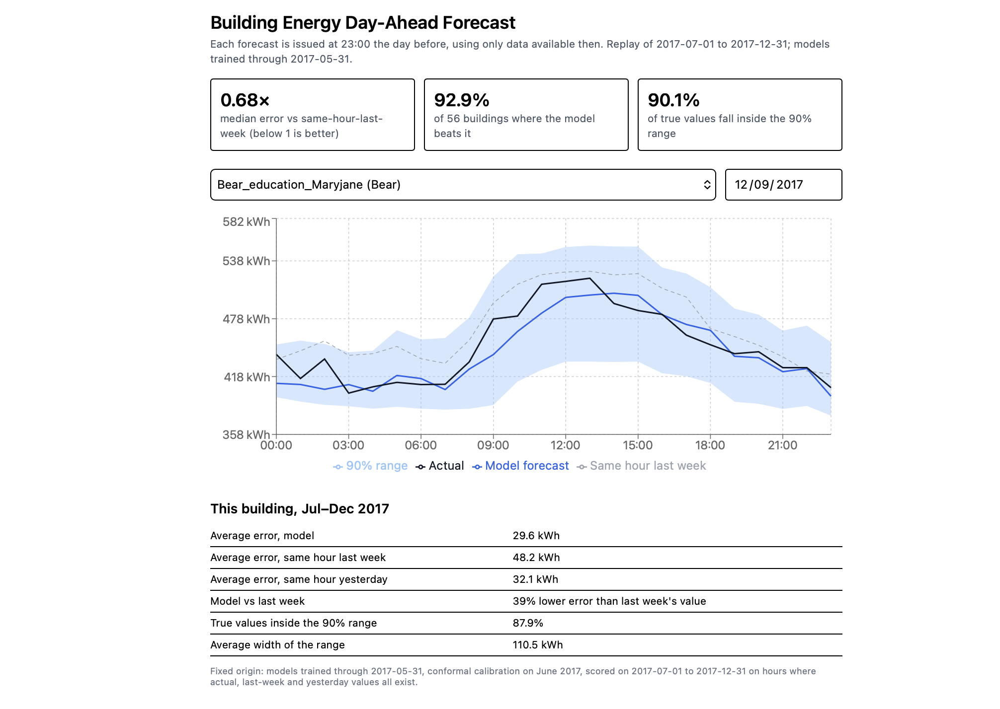

# Building Energy Day-Ahead Forecast

Day-ahead hourly electricity forecasts for 56 school buildings, with 90% prediction ranges, evaluated by forward-in-time backtests against "same hour last week" and "same hour yesterday" baselines.

**Live demo:** https://building-energy-forecast.onrender.com
(Free hosting: the first visit after 15 minutes of inactivity can take about a minute to wake up.)



## Results (July–December 2017, never seen in training)

| Measure | Result |
|---|---|
| Median error ratio vs same hour last week (below 1 is better) | 0.68 |
| Buildings where the model beats last week's value | 92.9% (52 of 56) |
| True values inside the 90% range | 90.1% |

The dashboard shows this fixed-origin run: models trained through 31 May 2017, range calibrated on June 2017, scored on July to December 2017.

A separate rolling backtest (6 monthly folds, retraining each month on earlier data, calibrating on the month before) gave:

| Measure per test month | Range |
|---|---|
| Median error ratio vs same hour last week | 0.62 to 0.77 |
| Buildings beating last week's value | 85.7% to 92.9% |
| Median error ratio vs same hour yesterday | 0.61 to 0.78 |
| Buildings beating yesterday's value | 83.9% to 92.9% |
| True values inside the 90% range | 87.5% to 91.3% |

## What it does

Every forecast is issued at 23:00 for the next day's 24 hours. Features use only data available at that moment: the same hour 1, 2 and 7 days earlier, yesterday's mean, minimum and maximum, the last observed reading, the forecast horizon (1 to 24), weekday and month. One global LightGBM model serves all buildings, with each building's load divided by its training-period mean. The 90% range comes from 5th and 95th percentile models, widened by a split-conformal correction computed on the previous month.

## How it is tested

- A leakage test: changing any data after the 23:00 issue time does not change any feature.
- Baseline, interval and conformal tests with hand-checkable answers.
- API tests for success, unknown building (404) and bad or out-of-range dates (422).
- GitHub Actions runs all 23 tests on Python 3.9 and 3.12, plus the frontend lint and build.

## Data and cleaning

Source: Building Data Genome Project 2 (1,636 buildings, hourly, 2016 to 2017). 1,578 have an electricity meter. I used the Education category (604 buildings, 15 sites). An hour counts as "dead" if the reading is zero or missing. Dead stretches longer than 168 hours were masked (not scored, not used). A building was kept if at most 5% of July–December 2017 and at most 50% of all hours were masked: 535 buildings. I then sampled up to 4 per site, giving 56 buildings from 14 sites.

## What went wrong, and what I learned

- **My first zero-run check undercounted.** It counted only exact zeros, so a missing hour split a dead stretch in two. Counting "zero or missing" doubled the number of Education buildings with a dead stretch over a week (103 to 206).
- **Healthcare was not an option.** The category exists (27 buildings with electricity, 6 sites), but only 13 passed a simple quality filter, so I chose Education.
- **Dead stretches are mostly a site problem.** Panther, Shrew, Cockatoo, Bobcat, Gator and Crow show site-wide dead periods. For Lamb and Eagle my test found none, but it could not rule out shared events affecting under half of a site's buildings, so that question stays open.
- **Weather did not help.** Observed air temperature, and temperature with simulated forecast error (1, 2 and 3 °C), all stayed within about ±0.2% of the no-weather model. I used one random seed, so differences this small cannot be separated from noise. Weather is not in the final model.
- **The raw quantile ranges under-covered** (85.6% to 90.0% per month). Conformal calibration raised that to 87.5% to 91.3%, still slightly below 90% in some months.
- **Hosting:** as of October 2026, Hugging Face Docker Spaces required a paid plan, so I used Render's free tier.

## Limitations

- This is a replay of a past period, not a live service. Dates are limited to July–December 2017 because the models were trained on earlier data. Earlier dates would be in-sample and flatter the results.
- 56 buildings from 14 sites. Buildings on one site share weather and behaviour, so the effective sample is closer to the number of sites. I did not test on held-out sites or other building types.
- There is no holiday or school-calendar feature, only weekday and month. School breaks are a likely source of larger errors, but I have not measured this.
- The 56 buildings were chosen using data-quality checks computed over the whole period, including the test months, which favours buildings with clean test data.
- Scores use only hours where the actual value and both baseline values exist.
- The 90% guarantee of conformal prediction assumes the data behaves consistently over time, which energy data only roughly does.
- Reproducing the data step needs the BDG2 repository downloaded with git-lfs. Paths in the scripts assume it sits at `~/Documents/building-data-genome-project-2`.

## Run locally

```bash
python -m venv .venv && source .venv/bin/activate
pip install -r requirements-dev.txt
python -m pytest tests -q
docker build -t building-energy-forecast . && docker run --rm -p 8080:8000 building-energy-forecast
```

Then open http://127.0.0.1:8080.

## Reproduce the results

With BDG2 downloaded, run in this order: `python src/prepare_data.py`, `python src/backtest_baselines.py`, `python src/backtest_model.py`, `python src/backtest_intervals.py`, `python src/backtest_weather.py`, `python src/train_final.py`.

## Layout

`src/` Python code (cleaning, features, baselines, uncertainty, API) · `tests/` · `notebooks/` data audit scripts · `frontend/` React + TypeScript dashboard · `deploy/` demo data, trained models and data notice · `Dockerfile`

## Data attribution

Miller, C., Kathirgamanathan, A., Picchetti, B. et al. The Building Data Genome Project 2, energy meter data from the ASHRAE Great Energy Predictor III competition. Sci Data 7, 368 (2020). https://doi.org/10.1038/s41597-020-00712-x
The data in `deploy/` is a modified subset, shared under CC BY-SA 4.0. See `deploy/NOTICE.md`.